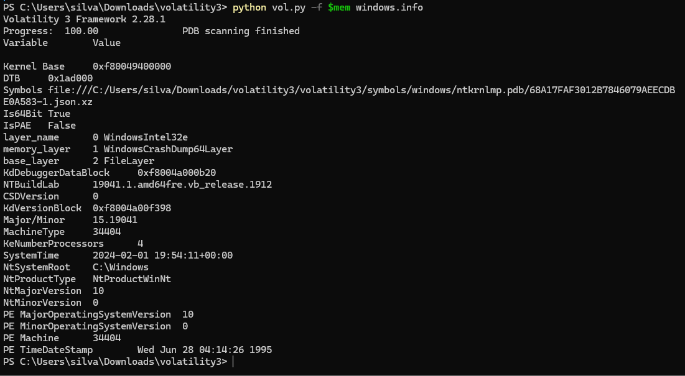
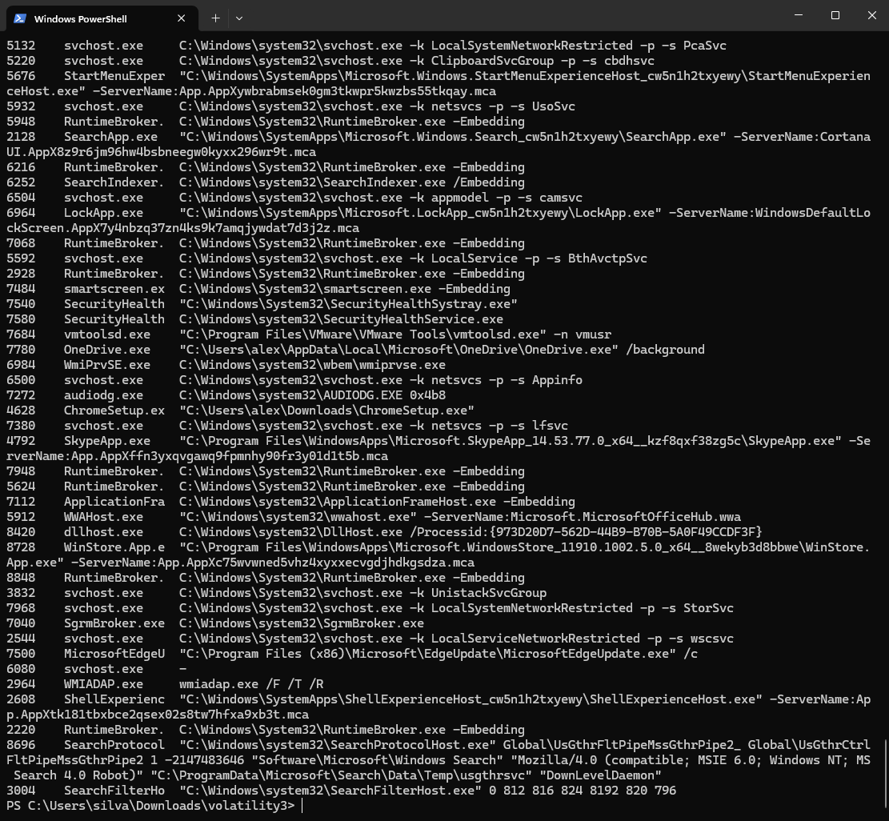
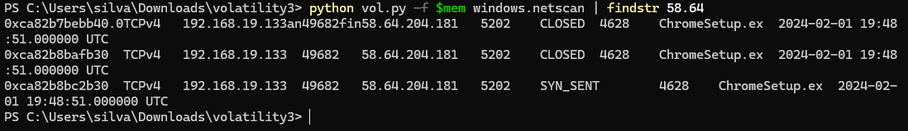
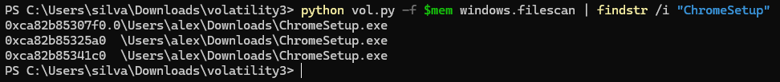

# Ramnit Endpoint Forensics Lab

## Overview

This repository documents my investigation of the CyberDefenders **Ramnit** lab using **Volatility 3** and threat intelligence analysis.

The objective of this investigation was to analyze a Windows memory dump, identify malicious activity, extract indicators of compromise (IOCs), and correlate findings with external intelligence sources.

> No malware samples or memory dump files are included in this repository.

---

## Key Findings

- Identified malicious process masquerading as Chrome installer
- Observed outbound communication to suspicious IP
- Correlated malware hash and domain indicators
- Confirmed malicious artifact through memory analysis

---

## Lab Information

| Category | Value |
|---|---|
| Platform | CyberDefenders |
| Category | Endpoint Forensics |
| Difficulty | Easy |
| Tools Used | Volatility 3, VirusTotal, PowerShell |
| MITRE ATT&CK | Execution, Defense Evasion, Command and Control |

---

# Investigation Objectives

- Analyze a Windows memory dump
- Identify suspicious processes
- Investigate command-line execution
- Extract network indicators
- Correlate malware hashes
- Document findings like a SOC analyst

---

## Commands Used

```powershell
python vol.py -f $mem windows.info
python vol.py -f $mem windows.cmdline
python vol.py -f $mem windows.netscan
python vol.py -f $mem windows.filescan
```

---

# Environment Setup






# Disclaimer

This repository is for educational and defensive cybersecurity purposes only.
The investigation was performed inside a safe lab environment provided by CyberDefenders.
